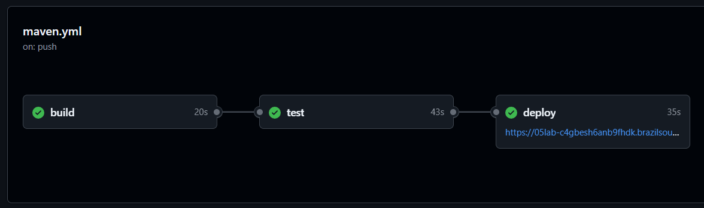
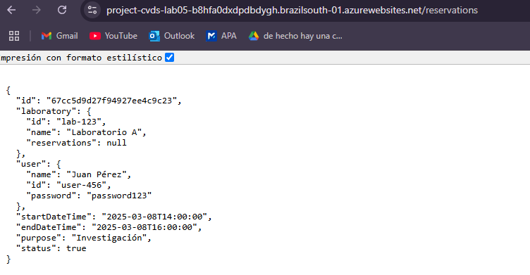
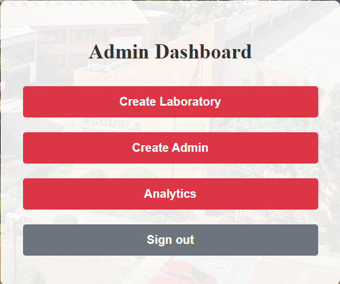
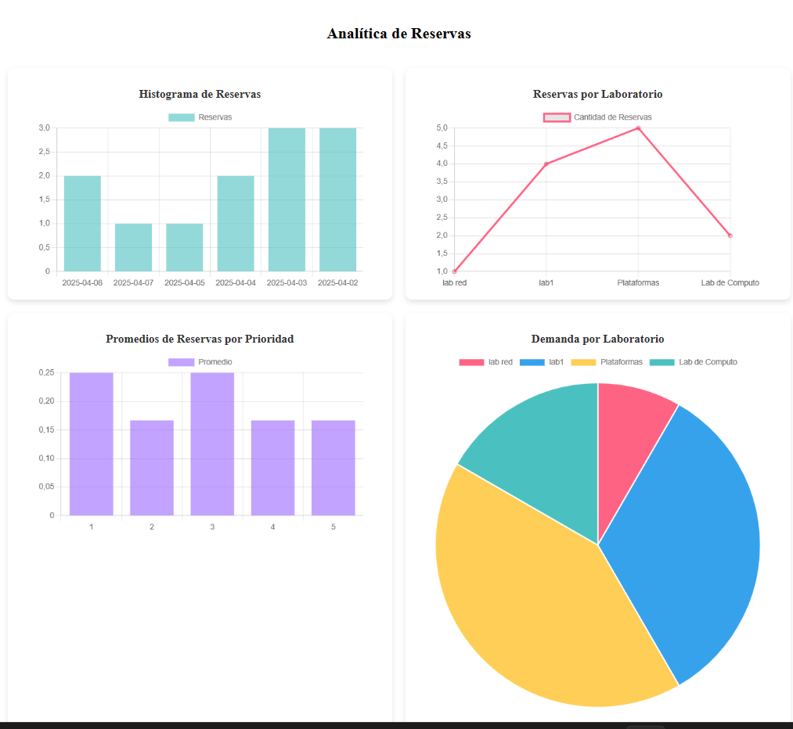

# Laboratorio 05 - CVDS

## PARTE I. DEVOPS / CI-CD

La integración y entrega continua (CI/CD) es un proceso clave en el desarrollo de software que automatiza la construcción, prueba y despliegue de aplicaciones. En GitHub Actions, este proceso se define mediante flujos de trabajo que se activan en eventos específicos, como cambios en el código o solicitudes de incorporación (pull requests).

### Procesos

1. Build (Construcción de la Aplicación)
   El proceso comienza con la fase de build, donde el código fuente se descarga y se compila para asegurar que no haya errores de sintaxis o dependencias faltantes. Se utiliza Maven para limpiar el proyecto, resolver las dependencias y generar los archivos compilados. Esta fase garantiza que el código es válido y está listo para las pruebas.

2. Test (Pruebas Automatizadas)
   Después de la compilación, se ejecutan pruebas unitarias y de integración. Estas pruebas validan que las funcionalidades del backend funcionan correctamente y que no hay regresiones en el código. Los resultados de las pruebas se almacenan como artefactos, junto con el archivo .jar generado. Esta fase es crucial para mantener la calidad del software y detectar errores antes de desplegarlo.

3. Deploy (Despliegue en Producción)
   Si las pruebas se completan con éxito, la aplicación se despliega automáticamente en un entorno de producción. En este caso, el backend se sube a Azure App Service, utilizando credenciales seguras almacenadas en GitHub Secrets. Esto permite que la aplicación esté disponible sin intervención manual, garantizando entregas rápidas y eficientes.

### Creando los Pipelines (CI - Continous Integration)

En esta fase del desarrollo del proyecto, se implementó la Integración Continua (CI) utilizando GitHub Actions, una herramienta que permite definir flujos de trabajo automatizados para gestionar el ciclo de vida del software. Esto permitió la creación de un pipeline estructurado, facilitando la construcción, prueba y despliegue del backend de manera eficiente y sin intervención manual.

La integración continua (CI) tiene como objetivo detectar errores de forma temprana, asegurando que cada cambio en el código se valide correctamente antes de fusionarse en la rama principal (main). Gracias a GitHub Actions, cada vez que se realiza un push o una pull request, se activa un workflow, que ejecuta una serie de tareas definidas en el archivo de configuración del pipeline.

Este workflow sigue una secuencia clara de pasos:

Descarga del código fuente: Se obtiene la última versión del repositorio.

Configuración del entorno: Se instala Java y Maven, asegurando la compatibilidad con el proyecto.

Compilación del código: Se ejecuta mvn clean compile para verificar que no haya errores en la construcción.

Ejecución de pruebas: Se corren pruebas automatizadas con mvn verify, permitiendo detectar posibles fallos.

Generación de artefactos: Se almacena el archivo .jar resultante para su uso en el despliegue.

La automatización de estos pasos evita la dependencia de procesos manuales y garantiza que cada cambio en el código cumpla con los estándares de calidad antes de avanzar a la siguiente fase del desarrollo.


## Despliegue exitoso en GitHub Actions


### Desplegando en Azure usando CI/CD (Continous Deployment / Continous Delivery)

Una vez que la aplicación ha sido construida y probada correctamente, el siguiente paso dentro del pipeline de CI/CD es el despliegue automático en un entorno de producción. En este caso, se utilizó Azure App Service, un servicio en la nube de Microsoft que permite hospedar aplicaciones web sin necesidad de gestionar la infraestructura.


## App Service creado en azure


## Pruebas en Postman


## Verificación del funcionamiento del App Service 


## PARTE II. GRÁFICOS

### Generación de datos por procedimientos

En esta fase del desarrollo, se creó una interfaz para el administrador, permitiendo la visualización de datos y análisis sobre los laboratorios y reservaciones. Además, se añadieron características como la gestión de prioridades y otros requisitos visuales para mejorar la experiencia del usuario.





# Spring Security

Spring Security es un framework de seguridad para aplicaciones Java basadas en Spring Boot. Su principal objetivo es proporcionar autenticación, autorización y protección contra vulnerabilidades comunes en aplicaciones web y APIs REST.

## Principales Características de Spring Security

### Autenticación y Autorización

Autenticación: Verifica la identidad de un usuario mediante credenciales (usuario y contraseña, tokens, OAuth, etc.).

Autorización: Controla qué recursos puede acceder un usuario autenticado según sus permisos o roles.

### Protección contra amenazas comunes

CSRF (Cross-Site Request Forgery): Previene ataques en los que un usuario autenticado realiza acciones no deseadas en su cuenta.

XSS (Cross-Site Scripting): Protege contra la inyección de scripts maliciosos en el navegador.

Fuerza bruta y ataques de diccionario: Implementa mecanismos como el bloqueo de cuentas tras varios intentos fallidos.

### Integración con múltiples métodos de autenticación

Usuarios en memoria (InMemoryUserDetailsManager).

Bases de datos (JDBC Authentication).

Servicios de autenticación como OAuth2, JWT (JSON Web Token), LDAP y OpenID Connect.

### Configuración flexible

Spring Security permite definir reglas de seguridad mediante archivos de configuración (SecurityFilterChain) o anotaciones en controladores (@PreAuthorize, @Secured).

Se puede personalizar la seguridad en endpoints específicos, estableciendo permisos en rutas sensibles y permitiendo acceso público en otras.

## Implementación

## Autenticación con JWT en Spring Security (Clase JwtRequestFilter)

### Implementación del método doFilterInternal

El método `doFilterInternal` es parte de un **filtro de seguridad** en Spring Security, utilizado para validar tokens JWT (JSON Web Token) en cada solicitud HTTP. Se ejecuta antes de que la solicitud llegue al controlador, asegurando que el usuario esté autenticado antes de acceder a recursos protegidos.

### **Código del filtro JWT**
```java
@Override
protected void doFilterInternal(HttpServletRequest request, HttpServletResponse response, FilterChain chain)
        throws ServletException, IOException {

    final String authorizationHeader = request.getHeader("Authorization");

    String username = null;
    String jwtToken = null;

    if (authorizationHeader != null && authorizationHeader.startsWith("Bearer ")) {
        jwtToken = authorizationHeader.substring(7);
        try {
            DecodedJWT decodedJWT = JWT.require(Algorithm.HMAC256("secret")).build().verify(jwtToken);
            username = decodedJWT.getClaim("username").asString();
        } catch (JWTVerificationException e) {
            response.setStatus(HttpServletResponse.SC_UNAUTHORIZED);
            response.getWriter().write("Token inválido: " + e.getMessage());
            return;
        }
    }

    if (username != null && SecurityContextHolder.getContext().getAuthentication() == null) {
        UserDetails userDetails = this.userDetailsService.loadUserByUsername(username);
        if (userDetails != null) {
            UsernamePasswordAuthenticationToken authentication = new UsernamePasswordAuthenticationToken(
                         userDetails, null, userDetails.getAuthorities());
            authentication.setDetails(new WebAuthenticationDetailsSource().buildDetails(request));
            SecurityContextHolder.getContext().setAuthentication(authentication);
        }
    }

    chain.doFilter(request, response);
}
```


## **Carga de Usuarios en Spring Security** (Clase UserDetailsServiceImpl)

En Spring Security, el servicio `UserDetailsService` se encarga de recuperar los detalles del usuario desde la base de datos para autenticación y autorización.  

Este método `loadUserByUsername` implementa la lógica para buscar un usuario en la base de datos y convertirlo en un objeto compatible con Spring Security.


### **Implementación:**
```java
@Override
public UserDetails loadUserByUsername(String username) throws UsernameNotFoundException {
    User user = userRepository.findUserByUsername(username);
    if (user == null) {
        throw new UsernameNotFoundException("Usuario no encontrado con el nombre de usuario: " + username);
    }
    List<GrantedAuthority> authorities = Collections.singletonList(new SimpleGrantedAuthority("ROLE_" + user.getRole().name()));

    return new org.springframework.security.core.userdetails.User(user.getUsername(), user.getPassword(), authorities);
}
```

## **Utilidad para Validación de JWT en Spring Security**

La clase `JwtUtil` es un componente de seguridad en Spring Boot que se encarga de validar los **JSON Web Tokens (JWT)** utilizados para la autenticación de usuarios.

Esta utilidad permite:  
✅ Decodificar y validar tokens JWT.  
✅ Verificar si un usuario tiene el rol de **ADMIN**.  
✅ Manejar errores en la validación del token.

---

### **Implementación:**
```java
@Service
public class JwtUtil {

    private String SECRET_KEY = "secret";

    public boolean validateAdmin(String token) {
        try {
            DecodedJWT decodedJWT = decodeToken(token);
            // Obtener el rol del token
            String role = decodedJWT.getClaim("role").asString();
            return "ADMIN".equals(role);
        } catch (JWTVerificationException e) {  // Captura todas las excepciones relacionadas con la verificación del token
            return false;
        }
    }

    private DecodedJWT decodeToken(String token) throws JWTVerificationException {
        JWTVerifier verifier = JWT.require(Algorithm.HMAC256(SECRET_KEY)).build();
        return verifier.verify(token.replace("Bearer ", ""));
    }
}

```