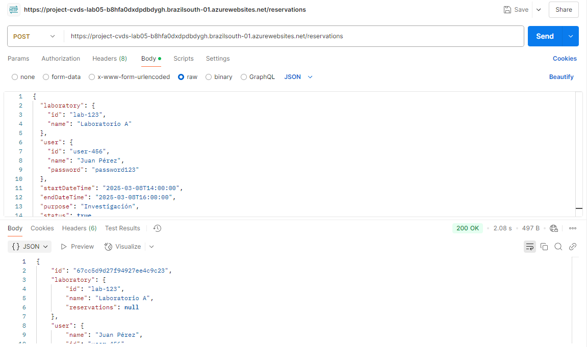

# lab05cvds

## PARTE I. DEVOPS / CI-CD

### Creando los Pipelines (CI - Continous Integration)

En esta fase del desarrollo del proyecto, se implementó la integración continua (CI) utilizando GitHub Actions. Esto permitió la creación de un workflow automatizado que facilitó la construcción, prueba y despliegue del proyecto de manera eficiente.

### Desplegando en Azure usando CI/CD (Continous Deployment / Continous Delivery)

## PARTE II. GRÁFICOS

### Generación de datos por procedimientos

En esta fase del desarrollo, se creó una interfaz para el administrador, permitiendo la visualización de datos y análisis sobre los laboratorios y reservaciones. Además, se añadieron características como la gestión de prioridades y otros requisitos visuales para mejorar la experiencia del usuario.

